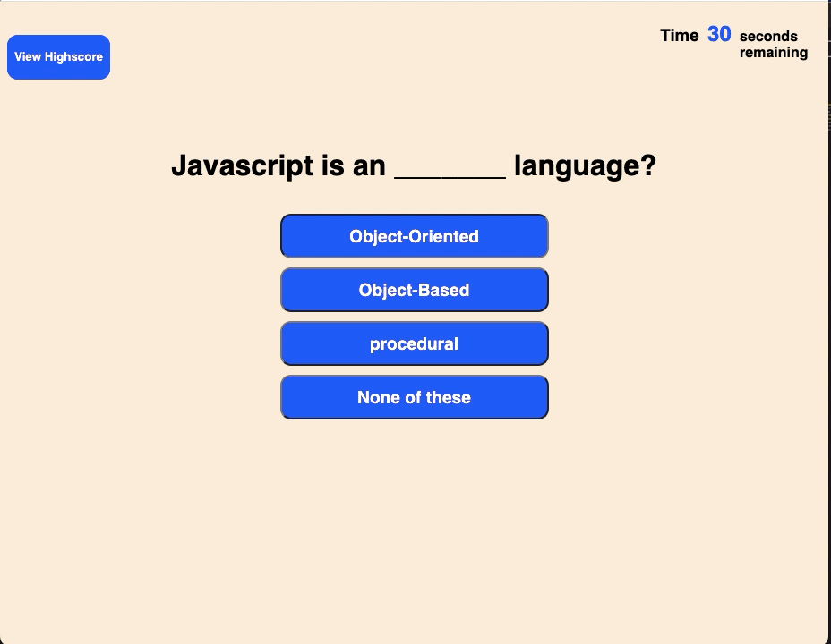

# Code Quiz

## For this project i was tasked with creating a Code Quiz game.  This code quiz would start when the user presses start and presents the user a series of multiple choice questions. At the end the user will be able to see their score and add their initials to save to a high score list.

### Things that I included in this Code Quiz

1. When user presses the start button the start button disappear, the timer starts and the user is presented with a question.

2. When the user answers a question they are presented with another question.

3. When the user gets a question wrong they will be penalized by taking 5 seconds from their time.

4. When the timer reaches 0 the user will be presented with an opportunity to save their score with their initials.

[gitHub pages](https://cefaust.github.io/Code-Quiz/)